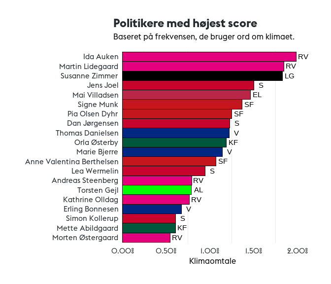
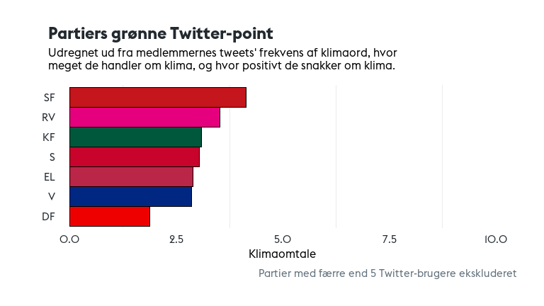

# 🌍 Hvor grønt snakker politikerne _egentlig_?
[Link til artiklen](https://www.dgsb.dk/blog/hvor-gront-snakker-politikerne-egentlig)
## Beskrivelse
Dette er den medfølgende information til artiklen udgivet på 
Den Grønne Studenterbevægelses (DGSB) blog. Her kan man finde
koden brugt til analysen, klimaord og figurer fra analysen. 

Den rå data er ikke tilgængelig her, da det ligger under for Twitters
betingelser, og vi dermed ikke må dele det.

## Filer
- [klimaord.md](klimaord.md) indeholder ordene brugt i analysen
- [/figurer](/figurer) indeholder alle output-figurerne fra analysen
- [analysis.Rmd](analysis.Rmd) indeholder hele analysen ud over...
- [analysis.py](analysis.py), der indeholder kode til at vurdere positivitet

## Første fem tweets i emne 14

1. "rt  danmarksnatur  grønne trepartsforhandlinger  mere urørt skov  jordreform  naturplan med bindende mål og løfter om mere fredet og beskyt "                                                                                                                                                                            
2. "fra sort os til grøn ros  flytrafikkens co2 udledning skal reduceres   dkgreen gjorde det med grøn omstilling af energien  nu skal transporten med  klogt at  sas selv at sætte kursen  fremtiden er grøn   også på vingerne  https   t co t9za9bvxvr"                                                                   
3. "rt  signe munk  nu får danmark en ambitiøs og bindende klimalov med mål om 70 procent reduktion i 2030  bindende delmål  reel grøn omstilli "                                                                                                                                                                            
4. "ny klimalov skal binde sikre mindst 60  reduktion af drivhusgas i 2030   spolitik er klar til at hæve ambitionerne med et nyt grønt flertal  flere energibesparelser  flere grønne biler  mere havvind  en skovfond og reduktioner i landbruget  dkgreen  dkpol https   t co 7o7rfnv3tc"                                 
5. "vindmoller lavere afgift på el til varme og el til transport fremmer elektrificeringen  generel sænkelse af elafgift øger co2 udledningen indtil al el er grøn   dkpol  dkgreen"

## Figurer
Emner fundet gennem maskinlæring (14 = klimaemne), farve = tal = emne.

Hvor meget de forskellige politikere snakker om klimaemnet (3, herover)

Samme som ovenstående men for partier

Frekvensen af klimaord i politikernes ordforbrug

Endelig score for partierne

Endelig score for politikerne

