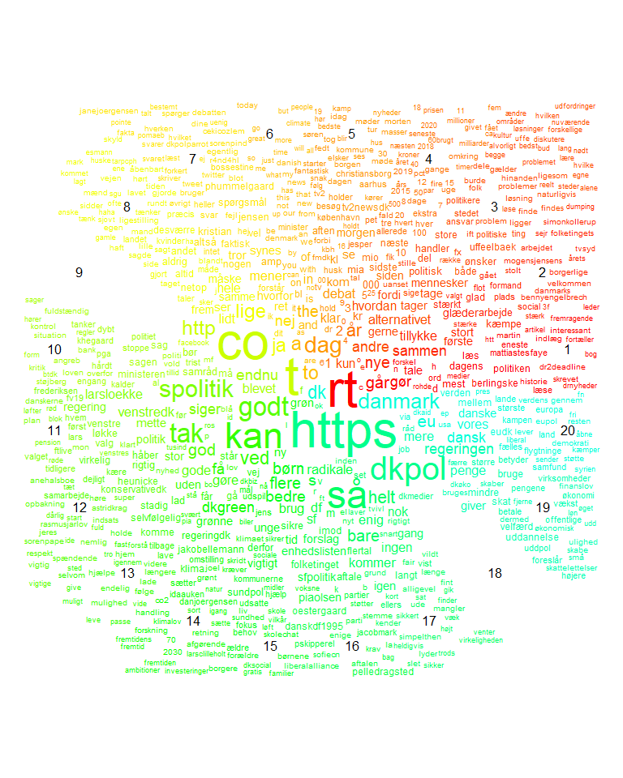

# Hvor grønt snakker politikerne _egentlig_?
## Beskrivelse
Dette er den medfølgende information til artiklen udgivet på 
Den Grønne Studenterbevægelses (DGSB) blog. Her kan man finde
koden brugt til analysen, klimaord og figurer fra analysen. 

Den rå data er ikke tilgængelig her, da det ligger under Twitters
betingelser og vi dermed ikke må dele det.

## Filer
- [klimaord.md](klimaord.md) indeholder ordene brugt i analysen
- [/figurer](/figurer) indeholder alle output-figurerne fra analysen
- [analysis.Rmd](analysis.Rmd) indeholder hele analysen ud over...
- [analysis.py](analysis.py), der indeholder kode til at vurdere positivitet

## Figurer
Emner fundet gennem maskinlæring (3 = klimaemne)

Hvor meget de forskellige politikere snakker om klimaemnet (3, herover)

Samme som ovenstående men for partier

Frekvensen af klimaord i politikernes ordforbrug

Endelig score for partierne

Endelig score for politikerne

