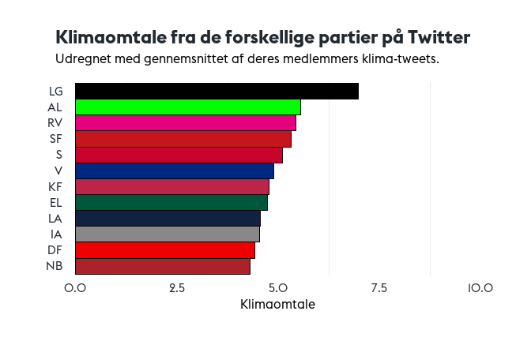
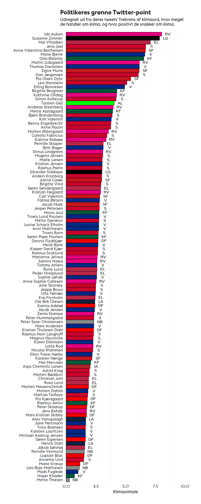

# Hvor grønt snakker politikerne _egentlig_?
## Beskrivelse
Dette er den medfølgende information til artiklen udgivet på 
Den Grønne Studenterbevægelses (DGSB) blog. Her kan man finde
koden brugt til analysen, klimaord og figurer fra analysen. 

Den rå data er ikke tilgængelig her, da det ligger under for Twitters
betingelser, og vi dermed ikke må dele det.

## Filer
- [klimaord.md](klimaord.md) indeholder ordene brugt i analysen
- [/figurer](/figurer) indeholder alle output-figurerne fra analysen
- [analysis.Rmd](analysis.Rmd) indeholder hele analysen ud over...
- [analysis.py](analysis.py), der indeholder kode til at vurdere positivitet

## Første fire tweets i emne 4

[1] "fn s klimapanels nye rapport viser  at der skal handles nu for at mindske udledning af drivhusgasser fra landbruget  vi skal både se på landbrugsstøtten  jordreform og mere grøn forskning nu tager vi fat sammen   dkpol  landbrug  klima  ippc  srccl https   t co q2badhl5fy"       
[2] "fokus på grøn og bæredygtig godstransport her hos dhls innovationscenter i bonn    lastbiler der platooner og sparer brændstof  el lastbiler  droner og store ladcykler   super spændende og visionært    dkpol  dktrp  cyklistforbund  misvsvane  fdmdk https   t co s113xni729"       
[3] "ny klimalov skal binde sikre mindst 60  reduktion af drivhusgas i 2030   spolitik er klar til at hæve ambitionerne med et nyt grønt flertal  flere energibesparelser  flere grønne biler  mere havvind  en skovfond og reduktioner i landbruget  dkgreen  dkpol https   t co 7o7rfnv3tc"
[4] "klimamålet kræver politisk handling     omend over 100  grøn strøm på sigt  så kommer co2 udslip ikke langt ned  hvis ik landbrug og transport kommer med  vi skal have sat el til transporten og landbruget skal have bindende reduktionsmål   dkpol  dkgreen https   t co t7hexvj9se" 

## Figurer
Emner fundet gennem maskinlæring (4 = klimaemne)

Hvor meget de forskellige politikere snakker om klimaemnet (3, herover)

Samme som ovenstående men for partier

Frekvensen af klimaord i politikernes ordforbrug

Endelig score for partierne

Endelig score for politikerne

